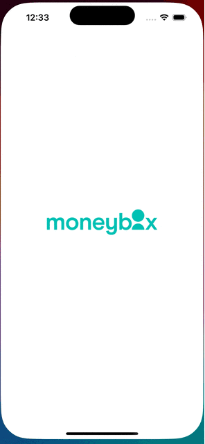

# Moneybox iOS Technical Challenge

The project structured following the MVVM-C architecture pattern combined with Clean Architecture principles. This promotes the separation of maintainability, concerns, and testability.

## MVVM-C Architecture Pattern

The MVVM-C separates an application into three main components:
- *Model*: data and business logic of the application.
- *View*: UI and layout of the screen.
- *ViewModel*: transforms the data from the Model into a format that can be easily displayed by the View.

- *Coordinator*: is responsible for managing the navigation within the screens.

## Clean Architecture

The Clean Architecture divides the project structure into different layers:
- *Presentation*: for the ViewModels and Views.
- *Domain*: contains the business logic and use cases of the application.
- *Data*: provides the data from APIs, storages and and interact with external dependencies.

## Modularity

The project presents a modular architecture introducing several modules (like Networking) for the separation of the code (no monolith). This modular approach allows an independent testing: the module can be tested separately without impacting the business logic, promoting better testability.

In particular, the `MBUI` module, it's a good example for introducing a technical design system and a starting point for a SwiftUI implementation. This helps in keeping the UI consistent and aligned with design guidelines.

## Considerations

Please note that error handling has not been fully implemented.
